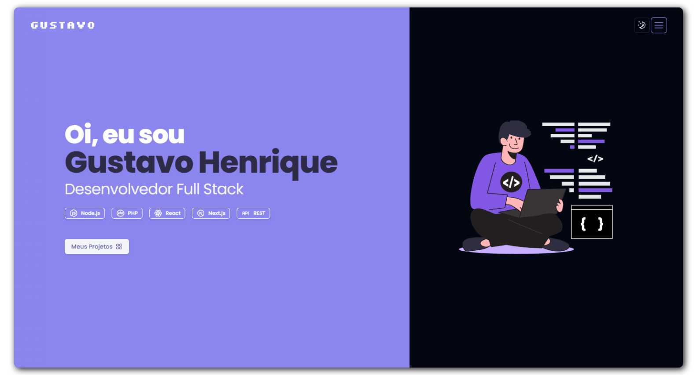

<h1 align="center"><div align="center"></div>Meu portifólio</h1>

<p align="center">
    
    
    
    
</p>
<a href="https://gustavohenrique.vercel.app" target="_blank"></a>

## :page_with_curl: Descrição

<p>Este é o meu website pessoal, criado para compartilhar um pouco sobre mim e apresentar alguns dos projetos que desenvolvi ao longo da minha jornada na área de tecnologia. Espero que goste 😎</p>

> Acesse aqui: https://gustavohenrique.vercel.app

# :hammer_and_wrench: Ferramentas
<p>
    
  
  
  
  
    
  
</p>

## :bookmark_tabs: Licença
Este projeto está sob licença MIT. Consulte ```LICENSE``` para mais informações.

## :adult: Autor

<!-- ALL-CONTRIBUTORS-LIST:START - Do not remove or modify this section -->
<!-- prettier-ignore-start -->
<!-- markdownlint-disable -->
<table>
  <tbody>
    <tr>
      <td align="center" valign="top" width="14.28%"><a href="https://gustavohenrique.vercel.app/"><br /><sub><b>Gustavo Henrique</b></sub></a><br /><a href="#code-Gustavohps10" title="Code">💻</a></td>
    </tr>
  </tbody>
</table>

<!-- markdownlint-restore -->
<!-- prettier-ignore-end -->

<!-- ALL-CONTRIBUTORS-LIST:END -->
